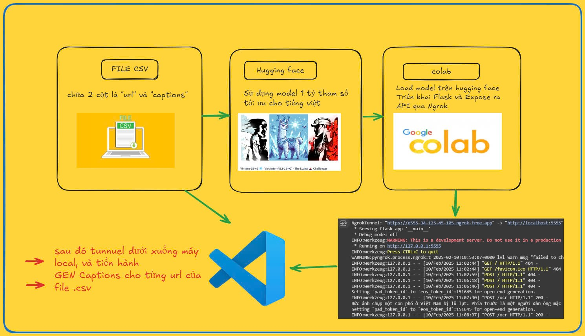

# Vietnamese Image Captioning Project

Dự án này cung cấp giải pháp tạo caption tự động bằng tiếng Việt cho hình ảnh sử dụng mô hình học sâu từ Hugging Face và được triển khai thông qua Flask API.



## Tổng quan

Hệ thống hoạt động theo quy trình sau:
1. Đọc dữ liệu từ file CSV chứa URL hình ảnh và caption
2. Sử dụng mô hình đã được tinh chỉnh trên Hugging Face để tạo caption tiếng Việt
3. Triển khai API thông qua Flask và expose qua Ngrok
4. Thực thi quá trình tạo caption thông qua môi trường local

## Yêu cầu hệ thống

- Python 3.x
- Google Colab (để chạy mô hình)
- Flask
- Ngrok
- Visual Studio Code (để phát triển và chạy locally)
- Các thư viện Python cần thiết (sẽ được liệt kê trong requirements.txt)

## Cấu trúc dự án

```
project/
├── data/
│   └── input.csv        # File CSV chứa URL và caption
├── models/              # Thư mục chứa mô hình
├── app.py              # Flask application
├── requirements.txt    # Các dependency
└── README.md          # Tài liệu hướng dẫn
```

## Cách sử dụng

### 1. Chuẩn bị dữ liệu
- Tạo file CSV với 2 cột: "url" và "captions"
- Đảm bảo URL hình ảnh có thể truy cập được

### 2. Thiết lập môi trường
```bash
# Tạo môi trường ảo
python -m venv venv
source venv/bin/activate  # Linux/Mac
# hoặc
venv\Scripts\activate     # Windows

# Cài đặt các dependency
pip install -r requirements.txt
```

### 3. Chạy mô hình trên Google Colab
- Tải mô hình từ Hugging Face
- Tinh chỉnh mô hình cho tiếng Việt
- Lưu mô hình đã train

### 4. Triển khai API
```bash
# Chạy Flask app
python app.py

# Trong terminal khác, chạy Ngrok
ngrok http 5000
```

### 5. Tạo caption
- Sử dụng Visual Studio Code để chạy script tạo caption
- Script sẽ đọc URL từ file CSV và tạo caption tương ứng

## API Endpoints

- `POST /generate-caption`
  - Input: URL hình ảnh
  - Output: Caption tiếng Việt

## Lưu ý

- Đảm bảo có kết nối internet ổn định khi sử dụng Ngrok
- Kiểm tra định dạng file CSV trước khi chạy
- Theo dõi log để phát hiện và xử lý lỗi

## Đóng góp

Mọi đóng góp đều được hoan nghênh. Vui lòng tạo issue hoặc pull request để cải thiện dự án.

## Giấy phép

[Thêm thông tin về giấy phép của dự án]