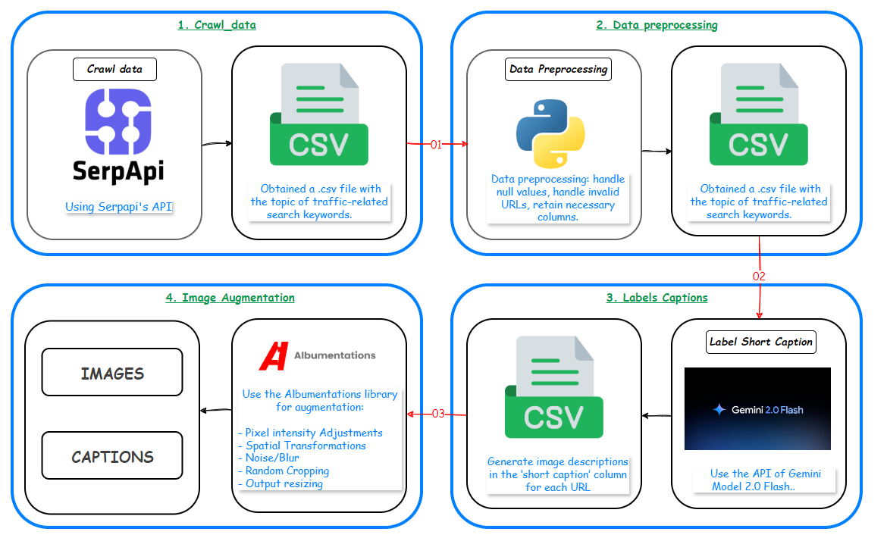

# 🚦 Vietnamese Image Captioning Project
 [🌏 English](README_en.md) |  [🌟 VietNamese](README_vn.md) 
This project provides an automated solution for generating Vietnamese captions for images using deep learning models from Hugging Face, deployed via a Flask API.

|                                                      **notebook**                                                       |                                                                                                                                  **open in colab / kaggle**                                                                                                                                  | **complementary materials** |                                                  **repository / paper**                                                   |
| :---------------------------------------------------------------------------------------------------------------------: | :------------------------------------------------------------------------------------------------------------------------------------------------------------------------------------------------------------------------------------------------------------------------------------------: | :-------------------------: | :-----------------------------------------------------------------------------------------------------------------------: |
| [LLM_Expose_Flask_API_With_Ngrok](https://github.com/TrieuPhi/Huggingface-Captioning-Data/blob/main/LLM_Ngok_API.ipynb) | [](https://github.com/TrieuPhi/Huggingface-Captioning-Data/blob/main/LLM_Ngok_API.ipynb) [](https://www.kaggle.com/code/trieuphi/llm-ngrok-api-using-kaggle) |                             | [](https://github.com/TrieuPhi/Huggingface-Captioning-Data/tree/main) |

> **Automatically generate Vietnamese traffic image captions using AI and modern data augmentation.**

---

## 📚 Overview

This project builds a Vietnamese traffic image dataset with concise captions, supporting computer vision tasks and accessibility for the visually impaired. The entire pipeline is automated: data crawling, cleaning, caption generation, and augmentation.

---

## 🗂️ Folder Structure

```
Germini-Captioning-Dataset-2025/
├── 1.crawl_data/                # Crawl traffic images from Google Images (SerpApi)
│   ├── output/                  # Store metadata, CSV results
│   └── python/                  # Crawling scripts
├── 2.data_preprocessing/        # Data cleaning and processing
│   └── jupyter/                 # Processing notebooks
├── 3.labels_short_captions/     # Generate short captions using Gemini API
│   └── python/                  # Captioning scripts
├── 4.Image_data_augument/       # Image data augmentation
│   └── python/                  # Augmentation scripts
├── image.png                    # Workflow diagram
├── README.md                    # This document
└── ...
```

---

## 🚀 Pipeline Overview



1. **Crawl Data**  
   Collect traffic images from Google Images via SerpApi, save metadata and images locally.

2. **Data Preprocessing**  
   Clean data: remove broken URLs, handle nulls, standardize fields.

3. **Labels Captions**  
   Use Gemini 2.0 Flash API to generate concise (10-15 words) captions for each image.

4. **Image Augmentation**  
   Augment data using modern image transformation techniques with [Albumentations](https://albumentations.ai/).

---

## 🏗️ Step-by-Step Details

### 1️⃣ Crawl Data

- **Goal:** Collect diverse traffic images using various keywords (e.g., "traffic light", "pedestrian crossing", "night traffic", ...).
- **Tools:** [SerpApi](https://serpapi.com/) + Python script ([traffic_raw.py](1.crawl_data/python/traffic_raw.py))
- **Output:**
  - `metadata.json` with detailed image info.
  - `traffic_images_dataset.csv` with URLs, titles, sources, resolutions, ...
- **Sample keywords:**
  - "pedestrian traffic light", "modern public transport", "motorbikes on sidewalk", ...

### 2️⃣ Data Preprocessing

- **Goal:** Clean data, remove broken images, standardize fields.
- **Tasks:**
  - Remove invalid URLs, images that can't be downloaded.
  - Handle missing/null values.
  - Keep necessary fields: `original_url`, `title`, `resolution`, ...
- **Output:**
  - Clean CSV, ready for captioning.

### 3️⃣ Labels Short Captions

- **Goal:** Generate concise, informative captions for each image.
- **Tools:**
  - Gemini 2.0 Flash API ([label_short_captions.py](3.labels_short_captions/python/label_short_captions.py))
- **Process:**
  - Read cleaned CSV.
  - Send each image URL to Gemini API with the following prompt:
    > "Describe the main content of the image, focusing on the current traffic situation. Keep the description short (about 10-15 words in one sentence), so that visually impaired users can quickly grasp the information."
  - Save results in the `short_caption` column.
- **Output:**
  - CSV file with captions for each image.

### 4️⃣ Image Augmentation

- **Goal:** Increase the size and diversity of the image dataset.
- **Tools:**
  - [Albumentations](https://albumentations.ai/) ([data_augument.py](4.Image_data_augument/python/data_augument.py))
- **Techniques:**
  - Pixel intensity adjustment (brightness/contrast/color)
  - Spatial transforms (rotation, scaling, shifting)
  - Add noise, blur, random crop, resize
- **Output:**
  - Augmented images in `augmented/images`
  - CSV file with captions for augmented images

---

## 💻 Quick Start Guide

### 1. Environment Setup

```bash
cd Germini-Captioning-Dataset-2025/1.crawl_data/
conda env create -f env_crawl_data.yaml
conda activate crawl_data
pip install -r ../3.labels_short_captions/python/requirements.txt
pip install -r ../4.Image_data_augument/python/requirements.txt
```

### 2. Run the Pipeline Steps

**Step 1: Crawl data**

```bash
python 1.crawl_data/python/traffic_raw.py
```

**Step 2: Data cleaning**

- Use the notebook or script in `2.data_preprocessing/jupyter/`

**Step 3: Caption generation**

```bash
python 3.labels_short_captions/python/label_short_captions.py
```

**Step 4: Augmentation**

```bash
python 4.Image_data_augument/python/data_augument.py
```

---

## 📊 Example Output

| original_url | short_caption                                      | augmented_image_path     |
| ------------ | -------------------------------------------------- | ------------------------ |
| ...          | "Busy street with heavy traffic during rush hour." | augmented/images/xxx.jpg |
| ...          | "Pedestrian crossing the street at crosswalk."     | augmented/images/yyy.jpg |

---

## 📝 Contribution & Contact

- Contribute ideas, report issues, or submit pull requests at [GitHub repository](https://github.com/TrieuPhi/Germini-Captioning-Dataset-2025/tree/main)
- Contact: dtptrieuphidtp@gmail.com

---

## 📄 License

This project is licensed under the [MIT License](LICENSE).

---

> **Made with ❤️ by Vietnamese AI Community**
